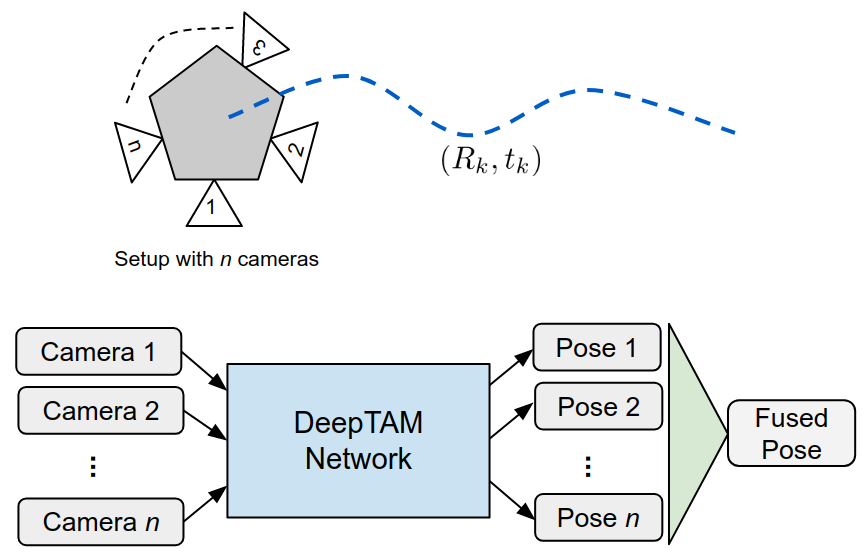

# Multi-Camera DeepTAM

Visual Odometry methods based on classical 3D geometry have been around for years, using either indirect feature matching or direct visual error minimization. Lately,learning-based methods that combine both matching and geometry estimation in a single network have achieved impressive results. One such method is DeepTAM. Further, it has been shown that classical methods benefit from the extended field of view provided by using multiple cameras. However, these setups have been ignored by current learning-based methods. 

In this work, we extend the existing DeepTAM pipeline to leverage a multi-camera setup with known geometry. We demonstrate the generalizability of DeepTAM to other monocular setups and highlight the scenarios in which it performs poorly. We show the efficacy of our proposed multi-camera VO pipeline to receive better pose estimates using experiments based on simulation.

__Contributors:__ [Mayank Mittal](http://mayankm96.github.io), [Rohit Suri](https://www.linkedin.com/in/rohit-suri-0966b0b3), Fadhil Ginting, Parker Ewen

<div style="text-align:center">
    
</div>

This code has been tested on a computer with following specifications:
* __OS Platform and Distribution:__ Linux Ubuntu 16.04LTS
* __CUDA/cuDNN version:__ CUDA 9.0.176, cuDNN 7.1.4
* __GPU model and memory:__ NVidia GeForce GTX 1070-MaxQ, 8GB
* __Python__: 3.5.2
* __TensorFlow:__ 1.9.0

## Dataset Directory Organization

For each camera, the directory should be organized as shown below:
```txt
data/
└── cam_1/  
    ├── depth
    ├── depth.txt
    ├── groundtruth.txt
    ├── rgb
    └── rgb.txt
```

The text files be similar to the ones present in [_TUM RGBD sequences_](https://vision.in.tum.de/data/datasets/rgbd-dataset), i.e. each line should first contain the timestamp information followed by the data:
* __Images__: Data is the file path relative to the sequence directory name specified in the `config.yaml` file
* __Groundtruth__: Data is the cartesian position and quaternion orientation of that particular camera (in world/camera frame)

#### Single Camera Setup

An example YAML configuration file for the RGBD Freiburg1 Desk Sequence is present [here](resources/hyperparameters/freiburg1_config.yaml). 

__NOTE:__ Please ensure that the sequence directory and camera intrinsics are correctly modified according to the dataset. 

#### Multiple Cameras Setup

For multi-camera, an additional YAML file needs to be written which would contain the path to all the configuration files 
for all the cameras in the system. An example for the same for AirSim dataset is available [here](resources/hyperparameters/airsim/airsim_config.yaml).
 
## Installation Instructions:

To install the virtual environment and all required dependencies, run:
```bash
./install.sh
```

Source the virtual environment installed:
```bash
workon deeptam_py
```

Download the pre-trained weights for the DeepTAM tracking network:
```bash
cd resources/weights
chmod +x download_weights.sh
./download_weights.sh
``` 

## Usage:

### Single Camera DeepTAM

__Input Arguments:__ 

* `--config_file` or `-f`: set to the path of configuration YAML file
* `--output_dir` or `-o`: set to the path of configuration YAML file (default: '')
*  `--weights` or `-w`: set to the path for the weights of the DeepTAM tracking network (without the .index, .meta or .data extensions)
*  `--tracking_network` or `-n`: set to the path of the tracking network (default: path to module deeptam_tracker.models.networks)
*  `--disable_vis` or `-v`: disable the frame-by-frame visualization for speed-up

__Example:__ 

* Download the RGBD Freiburg1 Desk Sequence:
```bash
cd resources/data
chmod +x download_testdata_rgbd_freiburg1.sh
./download_testdata_rgbd_freiburg1.sh
```

* To run DeepTAM with a single camera setup, run:
```bash
cd scripts
# run the python script
python single_camera_tracking.py \
    --config_file ../resources/hyperparameters/freiburg1_config.yaml \
    --weights ../resources/weights/deeptam_tracker_weights/snapshot-300000
```

### Multi Camera DeepTAM

__Input Arguments:__ 
* `--config_file` or `-f`: set to the path of YAML file for multi-camera 
*  `--weights` or `-w`: set to the path for the weights of the DeepTAM tracking network (without the .index, .meta or .data extensions)
*  `--tracking_network` or `-n`: set to the path of the tracking network (default: path to module deeptam_tracker.models.networks)
*  `--disable_vis` or `-v`: disable the frame-by-frame visualization for speed-up
*  `--method` or `-m`: type of pose fusion method to use (default: "rejection", options: "rejection"/"naive"/"sift")

__Example:__ 

* To download the SUNCG data with camera rig, download the zip file from [here](https://drive.google.com/open?id=19KEPRx_hSGu-oDUvotWAkko8fMcRvW91). Please copy the extracted 
data to the `resources/data` directory.
 
* To run DeepTAM with a multi camera setup with inlier-based averaging, run:
```bash
cd scripts
# run the python script
 python multi_camera_tracking.py \
    --config_file ../resources/hyperparameters/suncg3cameras/suncg_config.yaml \
    --weights ../resources/weights/deeptam_tracker_weights/snapshot-300000 \
    --method rejection
```
